# Galaxy for virologist training. Exercise 2: Quality control and trimming

Despite the improvement of sequencing methods, there is no error-free technique. A correct measuring of the sequencing quality is essential to identify issues in the sequencing process; thus, this must be the first step in every sequencing analysis. Once the quality control is finished, it's important to remove low quality reads, or short reads, which is why a subsequent trimming step is mandatory. After the trimming step, it is recommended to perform a new quality control step to be sure that trimming worked correctly.

## **1. Illumina Quality control and trimming**

<div class="tables-start"></div>

|**Title**| Pre-processing |
|---------|-------------------------------------------|
|**Training dataset:**|  **PRJEB43037** - In August 2020, an outbreak of **West Nile Virus** affected 71 people with meningoencephalitis in Andalusia and 6 more people in Extremadura (south-west of Spain), causing a total of eight deaths. The virus belonged to the lineage 1 and was relatively similar to previous outbreaks occurred in the Mediterranean region. Here, we present a detailed analysis of the outbreak, including an extensive phylogenetic study. This is one of the outbreak samples.
|**Questions:**| <ul><li>How do I check whether my Illumina data was correctly sequenced?</li><li>How can I improve the quality of my data?</li></ul>|
|**Objectives**:|<ul><li>Perform a quality control in raw Illumina reads.</li><li>Perform a quality trimming in raw Illumina reads.</li><li>Perform a quality control in trimmed Illumina reads.</li></ul>|
|**Estimated time**:| 25 min |

<div class="tables-end"></div>

### **1.1. Quality control**

#### **1.1.1. Upload data**

To run the quality control over the samples, follow these steps:

1. [**Create a new history, as we explained yesterday**](https://github.com/BU-ISCIII/galaxy_virologist_training/blob/one_week_4day_format/exercises/01_introduction_to_galaxy.md#2-galaxys-history) named **Illumina preprocessing**.
2. [**Upload data as seen yesterday**](https://github.com/BU-ISCIII/galaxy_virologist_training/blob/one_week_4day_format/exercises/01_introduction_to_galaxy.md#3-loading-data), copy and paste the following URLs:

```
ftp://ftp.sra.ebi.ac.uk/vol1/fastq/ERR531/002/ERR5310322/ERR5310322_1.fastq.gz
ftp://ftp.sra.ebi.ac.uk/vol1/fastq/ERR531/002/ERR5310322/ERR5310322_2.fastq.gz
```

3. Add some tags to the files. _**It is mandatory that the tag starts with `#` to be propagated to the processes**_.

</p>

#### **1.1.2. Run FastQC**

1. Search for the **FastQC** tool.
2. Select **FastQC Read Quality reports** and then set the following parameters:
3. Select multiple file data set in Raw read data from your current history.
4. Select the two datasets.
5. Then go down and select **Run tool**.

<p align="center">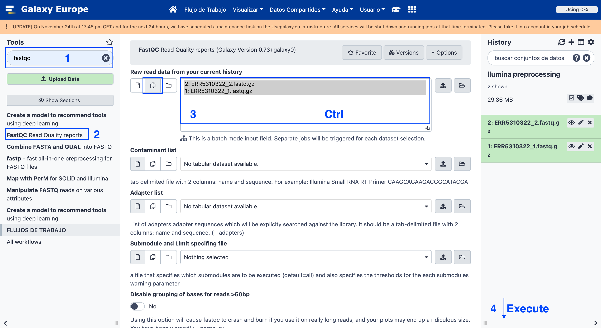</p>

To see the results we are going to open the jobs with **Web page** in their name for both data 1 and data 2.

<p align="center">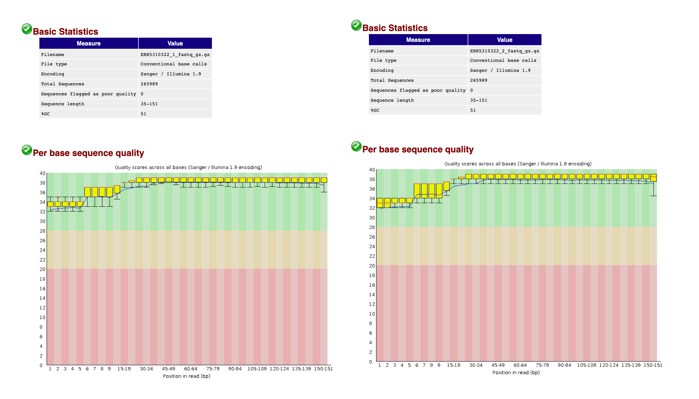</p>

Here, you can see the number of reads in each file, the maximum and minimum length of all reads in the sample, and the quality plots for both R1 and R2. They look quite good, but we are going to run trimming over the samples.

<details>
<summary>How many reads do the samples have?</summary>
<b>265989</b>
</details>

<details>
<summary>How do I check whether my Illumina data was correctly sequenced?</summary>
<b>Using FastQC</b>
</details>

### **1.2. Trimming**

Once we have performed the quality control, we have to perform the quality and read length trimming:

#### **1.2.1. Run Fastp**

1. Search for **fastp** in the tools.

2. Then select **fastp - fast all-in-one preprocessing for FASTQ files**.

3. Single-end or paired reads > **Paired Collection**

>[!WARNING]
To use this option from Fastp, it is necessary to first create a **list of paired datasets**, given our .fastq files, which will then be used for the rest of the steps of this workshop. In order to do so, we must:
>
>1. Select our fastqsanger.gz files that we uploaded in the beginning, and then click on _2 of X selected_.
>2. Select _Advanced Build List_.
>3. Select the _List of Paired Datasets_ box and click on *Next*.
>4. Check the auto-pairing configuration and click again on *Next*.
>5. Give a name to your list and finally click on *Build*.
>
> Once this is done, you'll be able to select your list as input of Fastp.

4. Display **Filter Options**
    - Quality Filtering options
      - Qualified Quality Phred = **30**
      - Unqualified percent limit = **10**
     - Length Filtering Options
       - Length required = **50**

5. Read modification options
   - PoliX tail trimming > **Enable polyX tail trimming**
   - Per read cutting by quality options
     - Cut by quality in front (5') > **Yes**
     - Cut by quality in tail (3') > **Yes**
     - Cutting mean quality = **30**

6. Finally, click on **Run tool**.

<p align="center">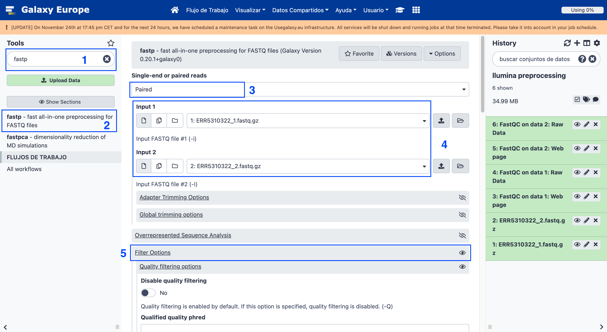</p>
<p align="center">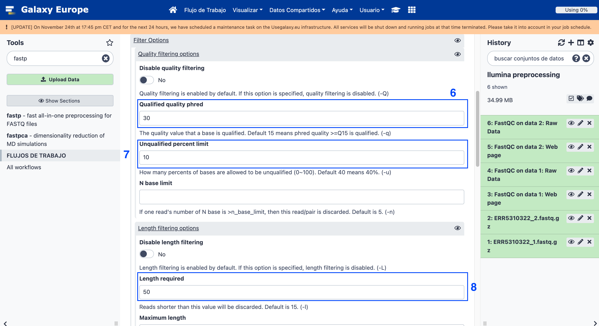</p>
<p align="center">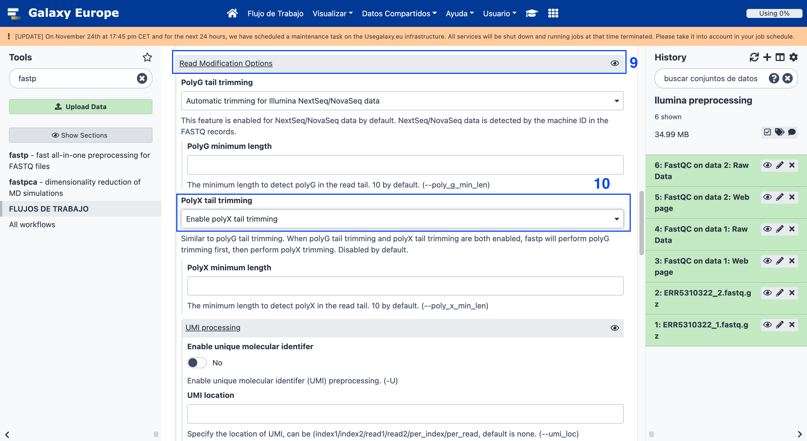</p>

To see the trimming stats, have a look at the **fastp on collection X: HTML report** file. You should see something like this.

<p align="center">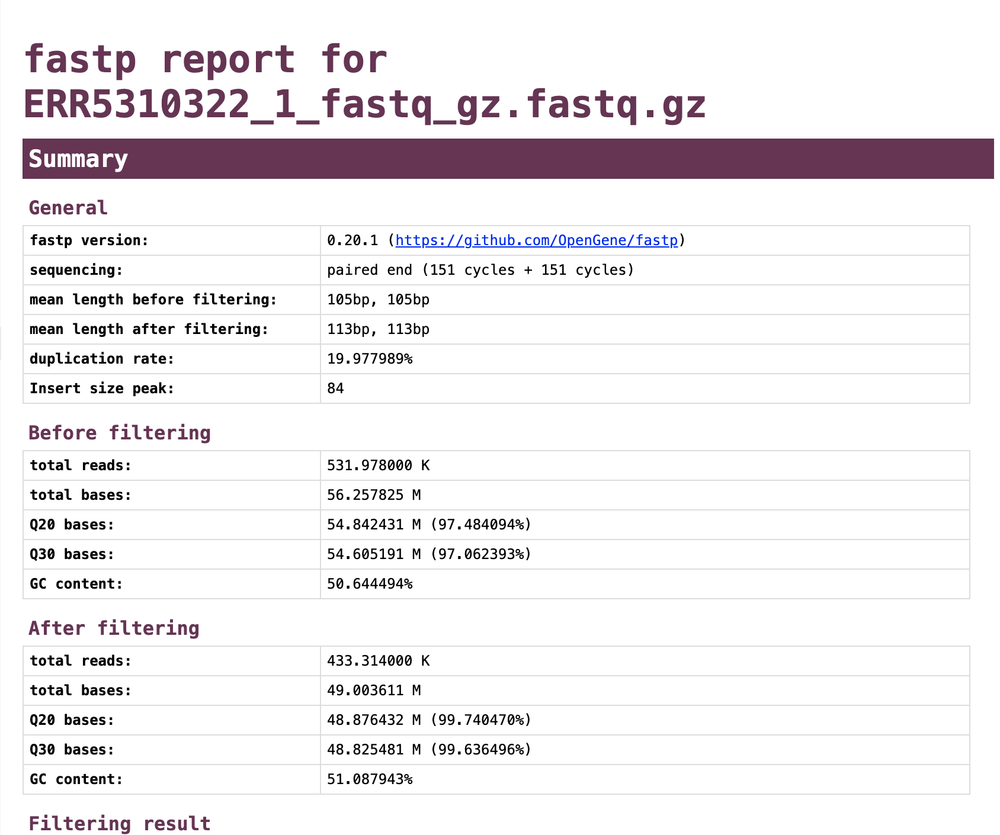</p>

<details>
<summary>How many reads have we lost?</summary>
<b>98664 reads</b>
</details>

#### **1.2.2. Other trimming tools: Trimmomatic**

1. Search for **trimmomatic** in the tools.

2. Select **Trimmomatic flexible read trimming tool for Illumina NGS data**.
   
3. Single-end or paired-end reads? > **Paired-end (as collection)**.

4. Average quality required = **30**.

5. Insert Trimmomatic Operation:
* Select Trimmomatic operation to perform: **MINLEN**.
* Minimum length of reads to be kept = **50**.

6. Select **Run tool**.

<p align="center">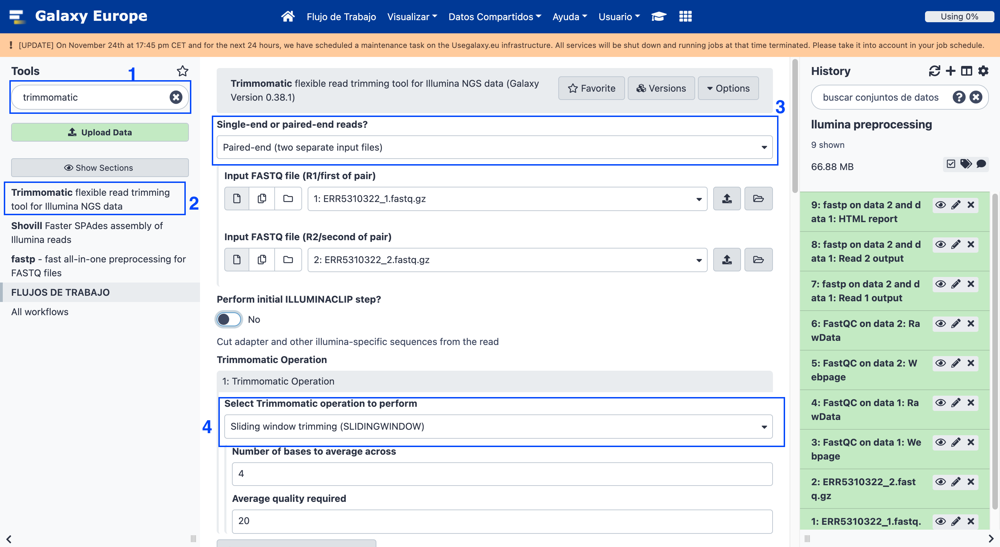</p>
<p align="center">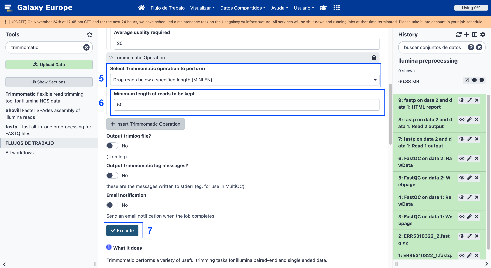</p>

Trimmomatic **does not** perform statistics over trimmed reads, so we need to perform FastQC again over the Trimmomatic results.

<details>
<summary>Try to do it on your own.</summary>
<br>
<p align="center">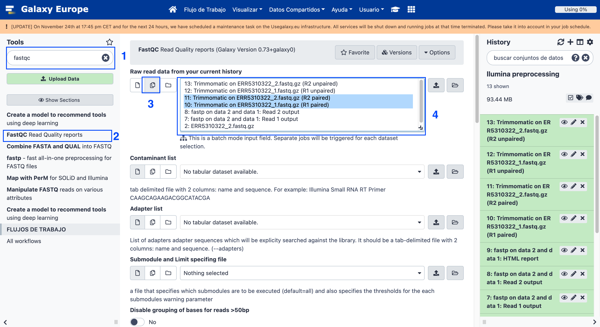</p>
<p align="center">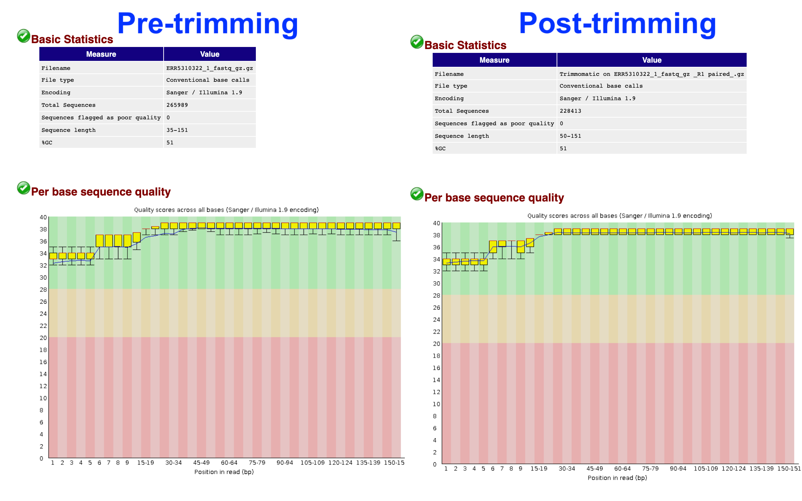</p>
</details>

<details>
<summary>How can I improve the quality of my data?</summary>
<b>Using a trimming software, such as fastp or trimmomatic.</b>
</details>
<br>

>**This hands-on history URL**: [https://usegalaxy.eu/u/svarona/h/illumina-preprocessing](https://usegalaxy.eu/u/svarona/h/illumina-preprocessing)

## **2. Nanopore Quality control and trimming**

<div class="tables-start"></div>

|**Title**| Galaxy |
|---------|-------------------------------------------|
|**Training dataset:**|  The data we are going to manage now corresponds to Nanopore amplicon sequencing data using ARTIC network primers for the SARS-CoV-2 genome. From the Fast5 files generated by the ONT software, we are going to select the **pass** reads, so they are already filtered by quality.
|**Questions:**| <ul><li>How do I know if my Nanopore data was correctly sequenced?</li></ul>|
|**Objectives**:|<ul><li>Perform a quality control in raw Illumina reads.</li><li>Perform a quality trimming in raw Nanopore reads.</li><li>Perform a quality control in trimmed Nanopore reads.</li></ul>|
|**Estimated time**:| 15 min |

<div class="tables-end"></div>

### **2.1. Quality control**

To run the quality control over the samples, follow these steps:
1. [**Create a new history has explained yesterday**](https://github.com/BU-ISCIII/galaxy_virologist_training/blob/one_week_4day_format/exercises/01_introduction_to_galaxy.md#2-galaxys-history) named **Nanopore quality**.
2. [**Upload data as seen yesterday**](https://github.com/BU-ISCIII/galaxy_virologist_training/blob/one_week_4day_format/exercises/01_introduction_to_galaxy.md#3-loading-data), copy and paste the following URLs:

```bash
https://raw.githubusercontent.com/nf-core/test-datasets/viralrecon/nanopore/minion/fastq_pass/barcode01/FAO93606_pass_barcode01_7650855b_0.fastq
https://raw.githubusercontent.com/nf-core/test-datasets/viralrecon/nanopore/minion/fastq_pass/barcode01/FAO93606_pass_barcode01_7650855b_1.fastq
https://raw.githubusercontent.com/nf-core/test-datasets/viralrecon/nanopore/minion/fastq_pass/barcode01/FAO93606_pass_barcode01_7650855b_2.fastq
```

#### **2.1.1. PycoQC**

To use PycoQC we need to use the `sequencing_summary.txt` provided by the Nanopore sequencing machine.

[**Upload data as seen yesterday**](https://github.com/BU-ISCIII/galaxy_virologist_training/blob/one_week_4day_format/exercises/01_introduction_to_galaxy.md#3-loading-data), copy and paste the following URL:

```bash
https://raw.githubusercontent.com/nf-core/test-datasets/viralrecon/nanopore/minion/sequencing_summary.txt
```

1. Search for the **Pycoqc** tool.
2. Select **Pycoqc quality control for Nanopore sequencing data**.
3. In *A sequencing_summary file*: Select the `sequencing_summary.txt` we just uploaded.
4. Select **Run tool**.

<p align="center">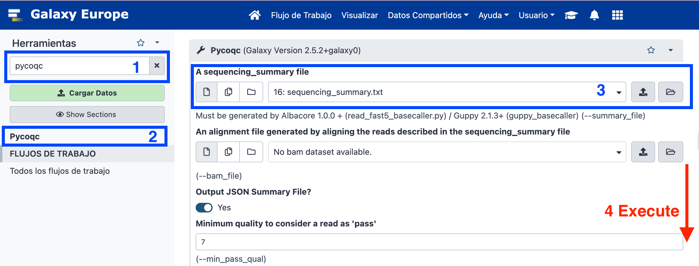</p>

Then inspect the resulting **PycoQC HTML Report**:

<p align="center">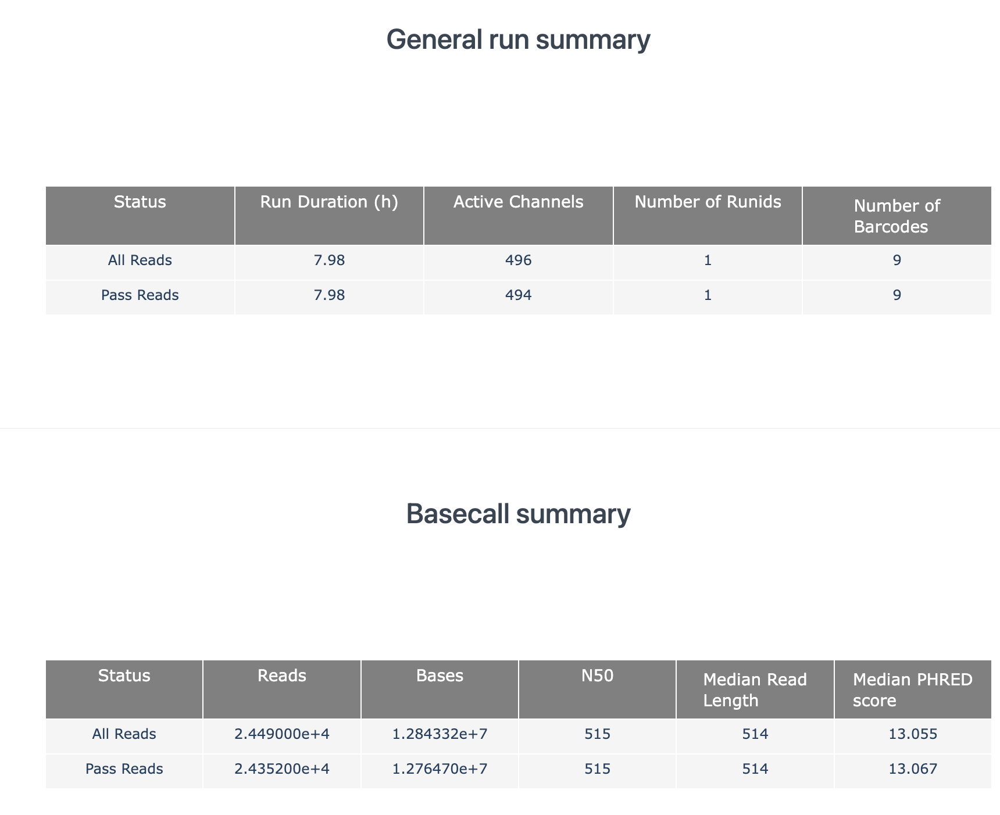</p>

**Questions**
<details>
<summary>How many reads do the samples have?</summary>
<b>3K reads</b>
</details>

<details>
<summary>Do you understand all the plots?</summary>
<b>Basecalled reads length:</b>
<p align="center">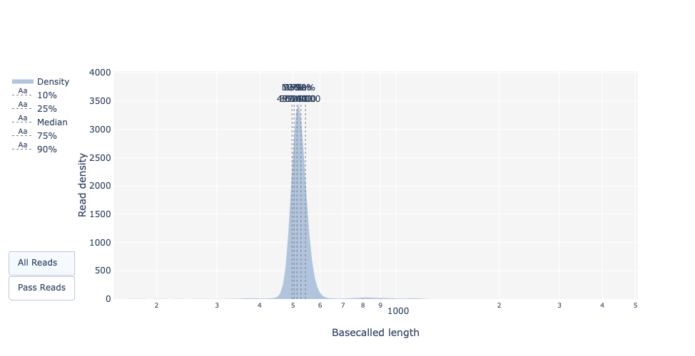</p>
This plot shows the distribution of fragment sizes in the file that was analyzed. Long reads have a variable length and this will show the relative amounts of each different size of sequence fragment. In this example, the distribution of read length is quite dispersed with a minimum read length for the passed reads around 150 and a maximum length ~5000bp. However, most of the reads are about 500 nt length, as expected by the amplicon experiment.
<br>
<b>Basecalled reads PHRED quality:</b>
<p align="center">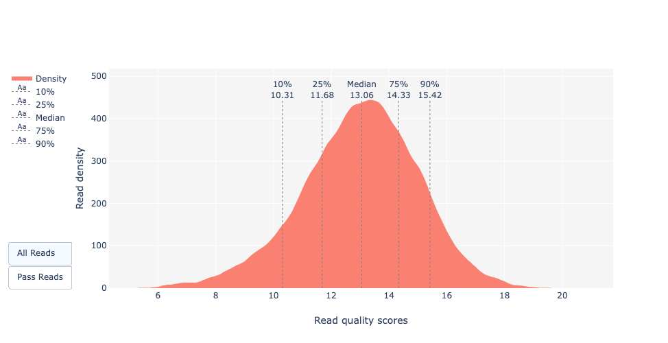</p>
This plot shows the distribution of the Qscores (Q) for each read. This score aims to give a global quality score for each read. The exact definition of Qscores is: the average per-base error probability, expressed on the log (Phred) scale. In case of Nanopore data, the distribution is generally centered around 10 or 12. For old runs, the distribution can be lower, as basecalling models are less precise than recent models. In our case, the median read Qscore is 13, which means that this run has good quality.
<br>
<br>
<b>Basecalled reads length vs reads PHRED quality:</b>
<p align="center">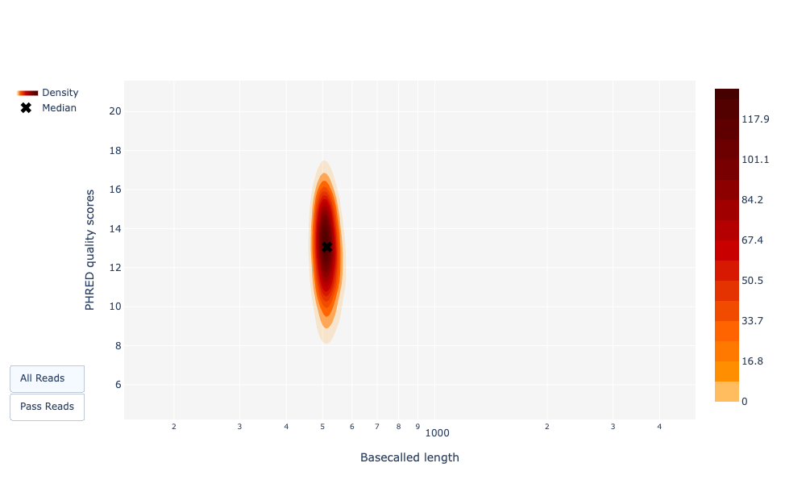</p>
This representation gives a 2D visualisation of read Qscore according to the length.
<br>
<br>
<b>Output over experiment time:</b>
<p align="center">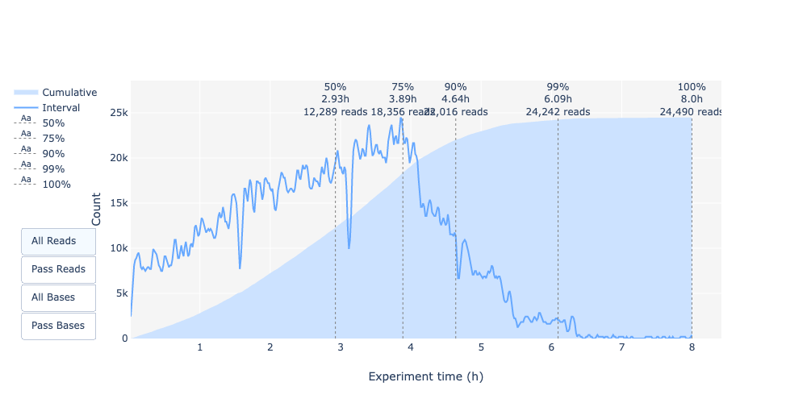</p>
This representation gives information about sequenced reads over the time for a single run. We can see that the production of reads is decreasing over time, which can be due to the sequencing of most of the genetic material, the saturation of pores and/or the degradation of the marial and/or pores. In this example, the “Cummulative” plot area (light blue) indicates that 50% of all reads and almost 50% of all bases were produced in the first 3h of the 8h experiment. We can see that from 6 to 8h of the experiment, only 200 reads were yielded, which means that we could have ended the experiment 2h before.
<br>
<br>
<b>Read length over experiment time:</b>
<p align="center">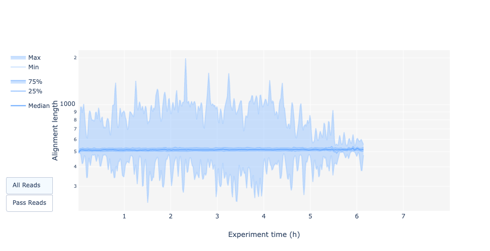</p>
The read length over experiment time should be stable. It can slightly increase over the time as short fragments tend to be over-sequenced at the beginning and are less present over the time. In this case, as almost all the fragments have the same length, the plot is really constant over time.
<br>
<br>
 <b>Read quality over experiment time:</b>
<p align="center">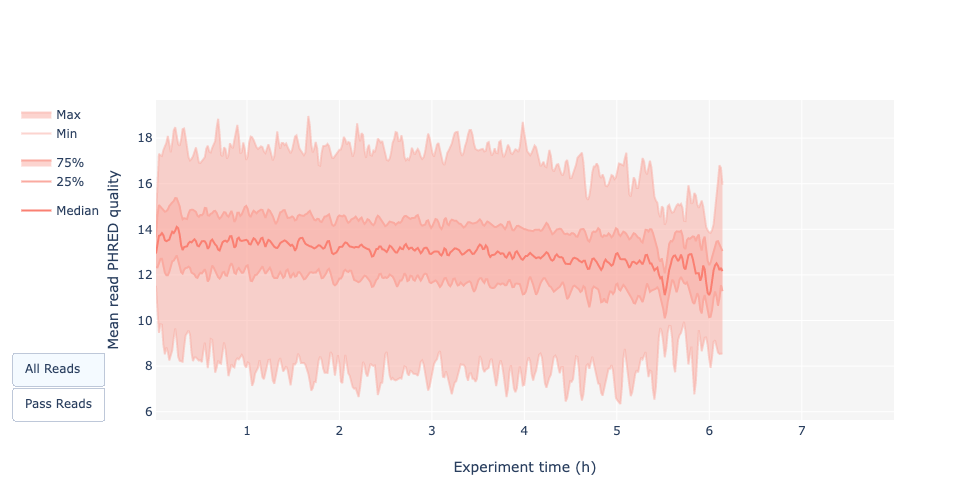</p>
The read quality over experiment time should be stable too, but usually it slightly decreases over time as pores get saturated or degraded. In this case, we can see a clear decrease of sequencing quality over the experiment time, but it stays within the good quality values, and this can be fixed with further post processing of the reads.
<br>
<br>

<b>Number of reads per barcode</b>:
<p align="center">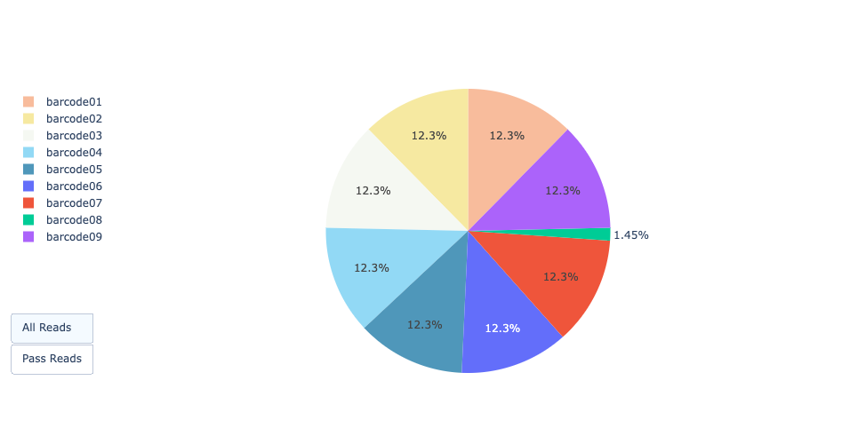</p>
This plot shows the number of reads per barcode, which means the number of reads per sample to be demultiplexed. In a good experiment, all the barcodes should have the same number of reads. In this training, we only use reads from the barcode01 sample, but we can see that barcode08 couldn't be correctly sequenced.
<br>
<br>
<b>Channel activity over time:</b>
<p align="center">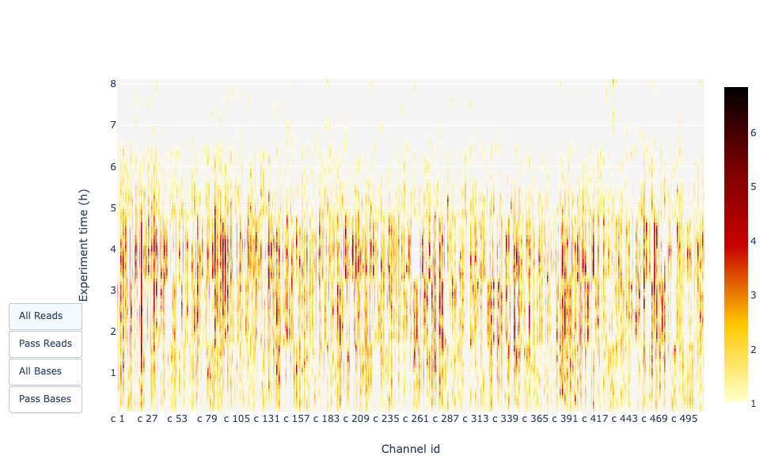</p>
It gives an overview of available pores, pore usage during the experiment, inactive pores and shows if the loading of the flow cell is good (almost all pores are used). In this case, the vast majority of channels/pores are inactive (white) after the 6h of experiment, so the run should have been finished at that time. You would hope for a plot that it is dark near the X-axis, and with higher Y-values (increasing time) doesn’t get too light/white. Depending on whether you choose “Reads” or “Bases” on the left, the color indicates either the number of bases or reads per time interval.
</details>
<details>
<summary>How do I check whether my Nanopore data was correctly sequenced?</summary>
<b>Using NanoPlot or PycoQC and having a look to the statistic values.</b>
</details>

### **2.2. Trimming**

When Nanopore reads are being sequenced, the **MinKnown** software splits Fast5 reads into quality **pass** and quality **fail**. As we will select only Fast5 **pass reads**, we won't need to perform a quality trimming, so even if we see that the reads have a bad Phred score, we know that the ONT software considered the reads as "**good quality**".

Then we will only be performing a **read length trimming**. Since we are using amplicon sequencing data, we won't be expecting reads smaller than 400 nucleotides, nor higher than 600, which would obviously correspond to **chimeric reads**.

#### **2.2.1. ARTIC**

1. Search for **artic** tool.
2. Select **ARTIC guppyplex Filter Nanopore reads by read length and (optionally) quality**.
3. Structure of your input data: **Multiple input datasets per sample**.
4. While pressing the *Ctrl* key, **select the three samples**.
5. Remove reads longer than = **600**.
6. Remove reads shorter than = **300**.
7. Do not filter on quality score (speeds up processing) = **Yes** (**we had already selected pass reads**).
8. Run Tool.

<p align="center">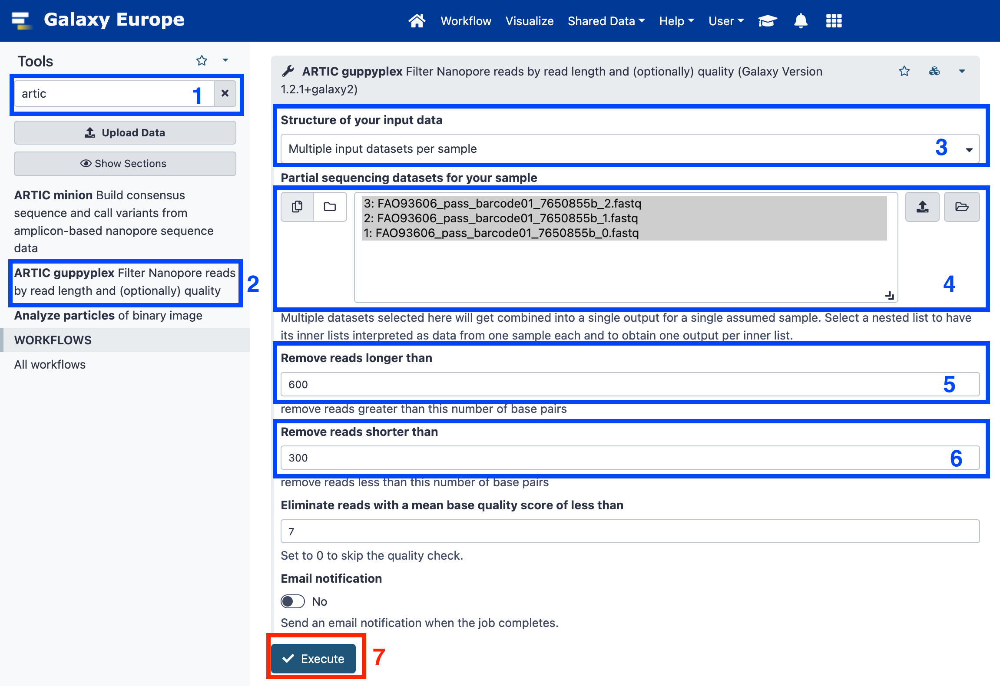</p>

#### **2.2.2. Nanoplot**

Now we are going to run **NanoPlot** on filtered data:

1. Search for the **Nanoplot** tool and select **NanoPlot Plotting suite for Oxford Nanopore sequencing data and alignments**
2. Run the tool as follows:
    - In the *files* part, select **ARTIC output file**.
    - Display **Options for customizing the plots created**:
        - **Specify the bivariate format of the plots** > _Select all_
        - **Show the N50 mark in the read length histogram** > _Yes_
3. Select **Run Tool**.

<p align="center">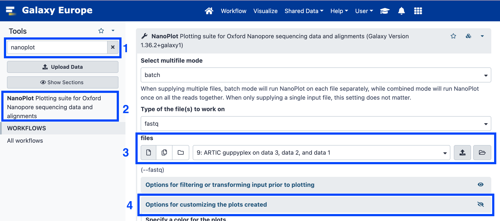</p>
<p align="center">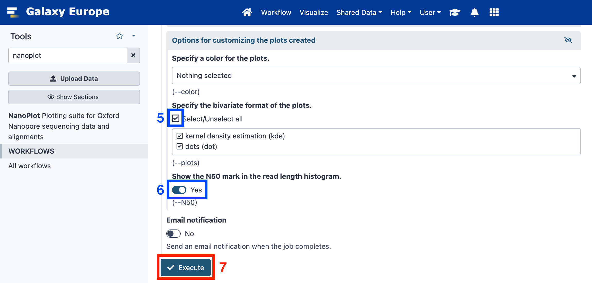</p>

**Questions**
<details>
<summary>Did our data length and quality improve?</summary>
<b>Yes, now we have reads within the length and quality specified.</b>
</details>

<details>
<summary>How many reads did we lose during the trimming step?</summary>
<b>138 reads</b>
</details>
<br>

>**This hands-on history URL**: [**https://usegalaxy.eu/u/svarona/h/nanopore-quality**](https://usegalaxy.eu/u/s.varona/h/nanopore-quality).
