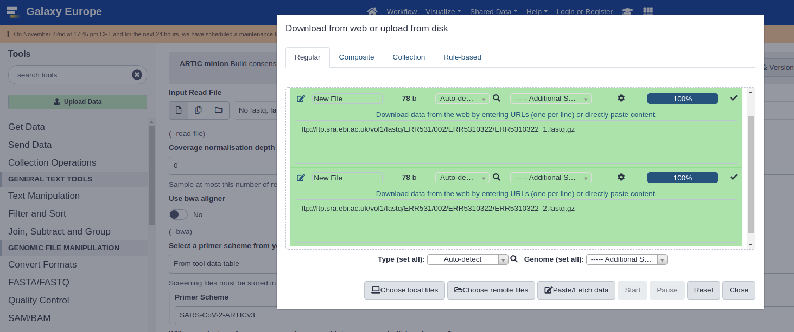
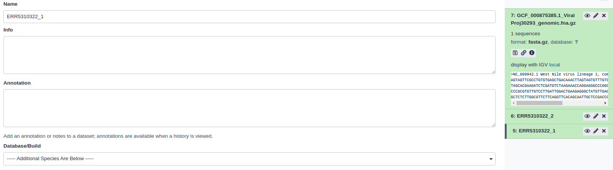
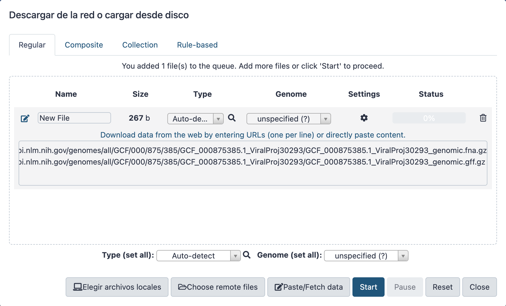
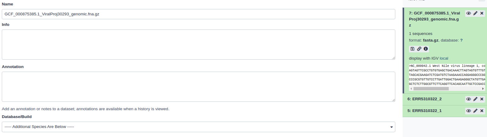
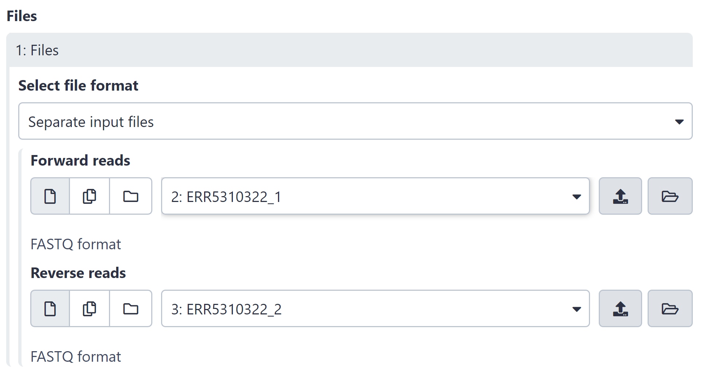
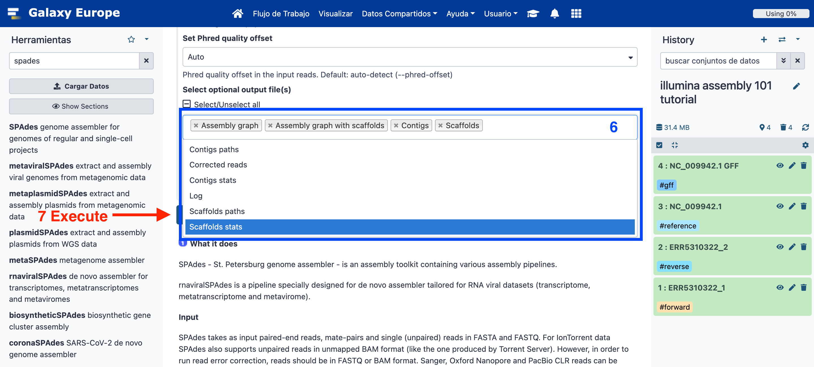
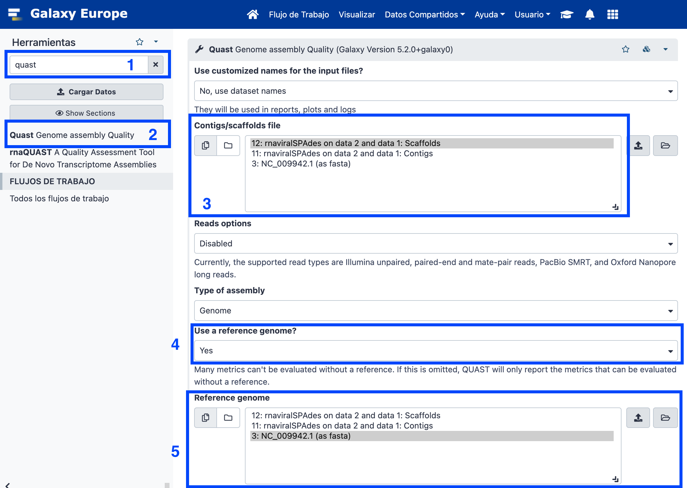
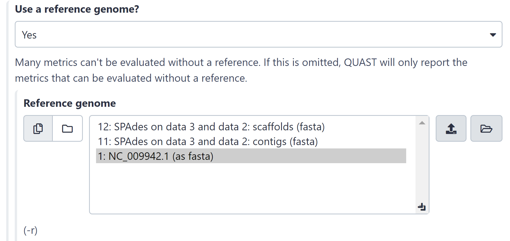
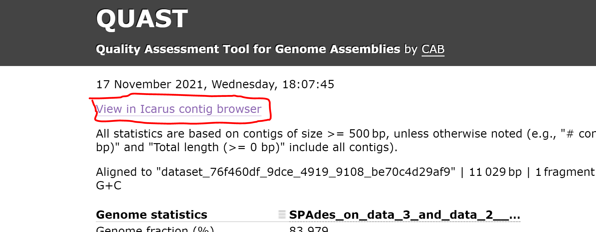

# Galaxy for virologist training. Exercise 3: Illumina Assembly 101

<div class="tables-start"></div>

|**Title**| Galaxy |
|---------|-------------------------------------------|
|**Training dataset:**|  **PRJEB43037** - In August 2020, an outbreak of **West Nile Virus** affected 71 people with meningoencephalitis in Andalusia and 6 more people in Extremadura (south-west of Spain), causing a total of eight deaths. The virus belonged to the lineage 1 and was relatively similar to previous outbreaks occurred in the Mediterranean region. Here, we present a detailed analysis of the outbreak, including an extensive phylogenetic study. This is one of the outbreak samples.
|**Questions:**| <ul><li>What is an assembly?</li><li>How can I evaluate my assembly?</li></ul>|
|**Objectives**:|<ul><li>Understand the assembly concept.</li><li>Learn how to interpret assembly quality control metrics.</li></ul>|
|**Estimated time**:| 40 min |

<div class="tables-end"></div>

## **1. Description**

Sometimes, we don't have a reference genome to map our reads against, or we want to reconstruct a genome without any possible bias caused by a reference. In such cases, we need to do a _**de novo assembly**_. This type of analysis tries to reconstruct the original genome without any templates, using only the reads themselves. 
Some considerations to consider beforehand:

- When we assemble, the longer the reads are and the longer the size of the library fragments, the easier it is for the assembler. That's why PacBio or Nanopore are recommended for assembly. Think of it like a puzzle, the bigger the pieces, the easier it is to form the image.
- It's almost imposible to reconstruct the entire genome of a large-genome microorganism with only one sequencing, although it can be done for smaller ones, like viruses.
- Assembly is not recommended for amplicon based libraries due to the depth of coverage unevenness and the amplicons' intrinsic bias.

## **2. Upload data to Galaxy**

### **Training dataset**

- Experiment info: PRJEB43037, WGS, Illumina MiSeq, paired-end.
- Fastq R1: [ERR5310322_1](https://ftp.sra.ebi.ac.uk/vol1/fastq/ERR531/002/ERR5310322/ERR5310322_1.fastq.gz) - URL : `ftp://ftp.sra.ebi.ac.uk/vol1/fastq/ERR531/002/ERR5310322/ERR5310322_1.fastq.gz`
- Fastq R2: [ERR5310322_2](https://ftp.sra.ebi.ac.uk/vol1/fastq/ERR531/002/ERR5310322/ERR5310322_2.fastq.gz)  URL : `ftp://ftp.sra.ebi.ac.uk/vol1/fastq/ERR531/002/ERR5310322/ERR5310322_2.fastq.gz`
- Reference genome **NC_009942.1**: [**FASTA**](https://ftp.ncbi.nlm.nih.gov/genomes/all/GCF/000/875/385/GCF_000875385.1_ViralProj30293/GCF_000875385.1_ViralProj30293_genomic.fna.gz) -- [**GFF**](https://ftp.ncbi.nlm.nih.gov/genomes/all/GCF/000/875/385/GCF_000875385.1_ViralProj30293/GCF_000875385.1_ViralProj30293_genomic.gff.gz)

### **Create new history**

- Click the `+` icon at the top of the history panel and create a new history with the name `Illumina Assembly` as explained [**here**](https://github.com/BU-ISCIII/galaxy_virologist_training/blob/one_week_4day_format/exercises/01_introduction_to_galaxy.md#2-galaxys-history).

### **Upload data**

- Import and rename the read files `ERR5310322_1` and `ERR5310322_2`
    1. Click on **Upload**.
    2. Click on **Paste/Fetch data**.
    3. Copy URL for fastq R1 (select and Ctrl+C) and paste (Ctrl+V).
    4. Click on **Start**.
    5. Wait until the job finishes (green in history).
    6. Do the same for fastq R2.

<p align="center"></p>

- **Rename R1 and R2 files**.
    1. Click on the ✏️ in the history for `ERR5310322_1.fastq.gz`.
    2. Change the name to `ERR5310322_1`.
    3. Do the same for R2.

<p align="center"></p>    

- Import the reference genome and GFF file.

```bash
https://ftp.ncbi.nlm.nih.gov/genomes/all/GCF/000/875/385/GCF_000875385.1_ViralProj30293/GCF_000875385.1_ViralProj30293_genomic.fna.gz
https://ftp.ncbi.nlm.nih.gov/genomes/all/GCF/000/875/385/GCF_000875385.1_ViralProj30293/GCF_000875385.1_ViralProj30293_genomic.gff.gz
```

<p align="center"></p>

- Rename the reference genome and gff file.
    1. Click on the ✏️ for the reference file in the history.
    2. Change the name to `NC_009942.1`.

<p align="center"></p>    

- Finally, add some useful tags if you like.

### **Assemble reads with SPAdes**

1. Search `Spades` in the search tool box and select _**rnaviralSPAdes de novo assembler for transcriptomes, metatranscriptomes and metaviromes**_.
2. Single-end or paired-end short-reads > **Paired-end: list of dataset pairs**.

>[!WARNING]
To be able to continue, it is necessary to first create a **list of paired datasets**, given our .fastq files, which will then be used for the rest of the steps of this workshop. In order to do so, we must:
>
>1. Select our fastqsanger.gz files that we uploaded in the beginning, and then click on _2 of X selected_.
>2. Select _Advanced Build List_.
>3. Select the _List of Paired Datasets_ box and click on *Next*.
>4. Check the auto-pairing configuration and click again on *Next*.
>5. Give a name to your list and finally click on *Build*.
>
> Once this is done, you'll be able to select your list as input of SPAdes.

3. FASTQ RNA-seq file(s): collection: **ERR5310322**
4. Select optional output file(s) > **Scaffolds stats** and **Contigs stats**, along with the options selected by default.
5. Click on **Run Tool** and wait.

<p align="center"></p>
<p align="center"></p>

>[!WARNING]
**Assembly takes time!**
> There is no such thing as Assembly in real time. It can take anywhere between 90 minutes and two hours.

**Questions:**

Click on the eye icon in the history: **Spades Contigs stats**.
    <details>
    <summary>How many contigs have been assembled?</summary>
    <b>46</b>
    </details>

### **Assembly quality control with QUAST**

1. Search QUAST in the search tool box.
2. **Assembly mode? > Individual assembly (1 contig file per sample)**.
3. Contigs/scaffolds file > **rnaviralSpades Scaffolds**
4. Use a reference genome? > **Yes**. Select the **NC_009942.1 FASTA file** previously loaded.
5. Genomic feature positions in the reference genome > **NC_009942. GFF file** previously loaded.

<p align="center"></p>
<p align="center"></p>

6. **Run Tool**.
7. Click on the eye icon of the **QUAST HTML report**.
    <details>
    <summary>How much of or reference genome have we reconstructed?</summary>
    <b>Genome fraction: 98.576%</b>
    </details>
    <details>
    <summary>How many contigs do we have greater than 1000 pb?</summary>
    <b>1</b>
    </details>
    <details>
    <summary>How long is the largest contig in the assembly?</summary>
    <b>11615 (only one contig)</b>
    </details>
    <details>
    <summary>Which is the N50?</summary>
    <b>11615</b>
    </details>

8. Open the **Icarus** viewer in the quast report.

<p align="center"></p>

<details>
 <summary>How did the contig align against our reference genome?</summary>
 <b>Misassembled blocks.</b>
</details>
<br>

> **This training history is available at**: https://usegalaxy.eu/u/s.varona/h/illumina-assembly-101-tutorial
